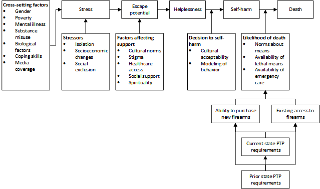

```{r read-data, include=F}
library(pander)
panderOptions('table.split.table', Inf) 

knitr::opts_chunk$set(echo=FALSE, warning=FALSE)
setwd('H:/thesis/data/')
load('tables_figures.RData')

panderOptions("table.alignment.default", 'right')

figure.counter <- 1

```

\pagebreak

#   Introduction

##  Background

In the wake of several highly publicized mass shootings, gun control has become one of the most divisive issues in American politics. Most recently, the murder of 49 people at a nightclub in Orlando, Florida has sparked a national debate about how and whether or not such events can be prevented in the future.[@herszenhorn_democrats_2016] This debate echoes the one after the 2013 shooting at Sandy Hook Elementary School in Newtown, Connecticut in which a gunman murdered 20 children and six adults.[@barron_gunman_2012] That event catalyzed an effort by Democrats in the federal government to severely restrict access to military-style rifles and to limit the legal size of ammunition magazines.[@weisman_drive_2013] Ultimately, each of those bills was rejected by Senate Republicans, but their shared goal (to prevent mass shootings) was reflective of the public discourse at the time.

However, this focus is not reflective of the true burden of gun violence in America. According to the US Centers for Disease Control and Prevention (CDC) nearly two-thirds of annual firearm deaths in the US (roughly 21,000 of 33,000 in 2013) are intentional self-harm.[@_suicide_2016; @_all_2016] Just under one-third of the remainder are homicides, and the rest (approximately 4%) are classified as accidental.[@_assault_2015] The CDC reports that slightly more than one-half of all suicides in the US were committed with a firearm, so any suite of gun control policies that does not include interventions specifically designed to prevent suicide (such as the one proposed after the Sandy Hook shooting) will leave the actual source of most firearm deaths unaddressed.  

Although gun violence is typically framed in criminological terms in the US, when we compare gun violence mortality rates in the US to rates in other countries, the need for a public health approach becomes clear. In 2013, the United States experienced a firearm mortality rate of 10.6 deaths per 100,000 people.[@_all_2016] This stands in stark contrast to the rate of death by firearm injury in every other developed country. Finland had the second highest rate in recent years: 3.6 deaths per 100,000 people in 2010, which is slightly more than one-third the American rate in 2013.[@alpers_finland_2015] In Canada in 2011, the mortality rate due to gun violence was 2.1 deaths per 100,000 people, just under one-fifth the US rate.[@alpers_canada_2015] The US is an extraordinary outlier among its economic peers in terms of firearm mortality.  

Efforts to rein in gun violence in the US typically take the form of federal- and state-level restrictions on firearm purchasing and ownership commonly referred to as "gun control." Several broad laws (most notably, the Brady Bill and the Federal Assault Weapons Ban) have been implemented by the federal government, but states have substantial latitude in regulating gun sales and ownership outside of the scope of federal regulation. The Brady Bill mandated federal background checks of all firearm purchasers in the United States and established a mandatory five-day waiting period on purchases.[@_brady_2016] It was effective until 1998 when the National Instant Background Check System was implemented. Similarly, the Federal Assault Weapons Ban outlawed ownership of "assault weapons" and "large capacity" ammunition magazines, but it expired in 2004 and has not been renewed.[@plumer_everything_2012] Both of these bills were designed with the intention of preventing homicide, not suicide.  

At the state-level, we see enormous variation in gun control policies. Whereas several allow concealed carry of firearms on public university campuses, Governor Jay Inslee of Washington state has launched a highly publicized public health capaign to fight gun violence.[@thompson_inslee_2016] At an even more granular level, some individual counties and municipalities have enacted their own gun control measures. For instance, handgun sales were illegal in Chicago, Illinois until 2013.[@clark_short_2014] Many states have passed "preemption" laws that prevent smaller governments within the state from passing more severe gun control laws than the state legislature.[@valentine_disarmed:_2014] Despite this smaller-scale variation, most direct gun control policymaking is done in state legislatures.

However, the effectiveness of these laws is all but completely unknown because the epidemiological dynamics of gun violence are poorly understood at best. After Kellermann *et al.* published their study identifying firearm ownership as a risk factor for homicide in 1993, the National Rifle Association (NRA) began a lobbying campaign to defund the CDC's National Center for Injury Prevention.[@kellermann_gun_1993;@jamieson_gun_2013] That effort failed, but, working with House Representative Jay Dickey, an amendment was inserted into the 1996 Omnibus Consolidated Appropriations Bill that prevented the CDC from using any of its injury prevention funding in FY 1997 for the promotion of gun control. This amounted to a ban on gun violence research that persists to this day.  

The result of this ban has been a near-total drought of published research on gun violence prevention, making evidence-based policymaking impossible. The national debate around one of the most controversial political issues in modern American politics is fueled by anecdotes and untested theories. The popular discourse around suicide is particularly unproductive. There is a widespread perception of suicide as inevitable, leading to its dismissal as a preventable public health crisis. Gun rights advocates argue that gun control cannot prevent suicide because people who cannot access a firearm to commit suicide will just commit suicide using some other method.[@denise_no_2016;@_gun_2015;@wright_ezra_2015] This substitution hypothesis warrants particular scrutiny because firearms are far and away the most lethal means of attempting suicide.[@shenassa_lethality_2003]  

In summary, most of the public discussion of gun control centers around mass shootings, but the largest source of health loss from firearms is suicide. However, the epidemiology of gun violence is poorly understood at best, making evidence-based decision making impossible.

##  Research Question

In this study, we attempted to test the theory that particular gun control policies were effective in reducing firearm suicide mortality rates. We sought to help inform one of the most contentious debates in American politics and to fill the substantial data gaps in the rapidly growing field of gun violence research. More specifically, we chose to estimate the effect of handgun permit-to-purchase (PTP) requirements on firearm suicide mortality. PTP requirements mandate that all potential handgun purchasers at certified sellers must present a permit or license issued by the state. We focused on this one policy for several reasons. First, it has been identified as an important item in the existing set of gun control policies by advocacy gropus on both sides of the issue.[@_licensing_2016] Second, requiring potential handgun purchasers to have already acquired a state-issued permit fits neatly into the model of gun control as a suicide prevention tool. Finally and most practically, it was only possible to research the legislative history of one policy for all fifty states.

We can rephrase this question quantitatively: Do policies requiring potential handgun purchasers to have a state-issued permit or license significantly reduce firearm suicide mortality? We hypothesized that these laws were effective and that we would observe significantly lower firearm suicide mortality in places with such requirements.

As a secondary analysis, we examined the previously discussed substitution hypothesis by trying to identify any effect handgun purchasing permit requirements had on suicide by all non-firearm means and whether this substitution effect negated the benefits of the law. Given the relatively high lethality of firearms as a means of attempting suicide, we hypothesized that we would not see an increase in suicide by other means and that, if we did, it would be outweighed by the observed benefits. Even if every person who could not get access to a firearm for suicide attempted suicide by some other means, we would still expect to see a net benefit.

##  Literature Review

The existing body of literature examining the public health effects of gun control is relatively small given the scale of the problem. Several studies have examined the relationship between handgun purchasing policies and firearm mortality. Webster *et al.* used generalized least squares regression models to estimate the effect of Missouri's 2007 repeal of its PTP requirement on mortality.[@webster_effects_2014] They found that it corresponded with a significant 23% increase in annual firearm homicide rates. Rudolph *et al.* used a "synthetic control method," which uses comparable states as artificial controls, to find that Connecticut's 1995 implementation of a PTP law was associated with a 40% decrease in firearm homicide mortality over the course of 10 years.[@rudolph_association_2015] In a 2015 study that also used a synthetic control method, Crifasi *et al.* associated Connecticut's implementation of a PTP law with a 15.4% reduction in firearm suicide rates and Missouri's repeal of its law with a 16.1% increase in firearm suicide rates.[@crifasi_effects_2015] Anestis *et al.* found that states with PTP requirements experienced significantly lower firearm suicide mortality in 2013 than states without PTP requirements.[@anestis_association_2015]

Although all of these studies found substantial and significant effects, their designs severely limit the extent to which we can infer that their results are causal. Webster *et al.* and Anestis *et al.* both parameterized the exposure variable as a state-year specific binary based on whether that particular state had a PTP law in that year. In the case of Webster *et al.*, this means that the authors identified a significant discontinuity in the level of firearm homicide mortality before and after the policy, but this change could easily be attributable to another policy change in a similar year or to a more gradual social process that had been in the process for years. In the case of Anestis *et al.*, the authors only used data from 2010, meaning that the differences they capture between states could easily be a result of more abstract cultural factors, not any particular policy. The synthetic control approach used by Rudolph *et al.* and Crifasi *et al.* is vulnerable to similar problems. Its validity depends entirely on the appropriateness of the controls used to generate the synthetic counterfactual series, so, as with the binary exposure variable, it is difficult to say that the model is capturing the effect of one particular policy or another.

Several other studies have looked more generally at the health effects of gun control or at other particular policies. In order to create more variation across states in the exposure variable and to avoid bias due to co-occurence of laws, many studies collect laws into legislative strength scores. Since 2007 the Law Center to Prevent Gun Violence and the Brady Campaign to Prevent Gun Violence have produced a state gun law scorecard that assigns higher numeric and letter grades to states with more (and more "effective") gun control laws. Fleegler *et al.* found that, between 2007 and 2010, states in the highest quartile of this score had significantly lower overall firearm mortality, homicide firearm mortality, and suicide firearm mortality than states in the bottom quartile.[@fleegler_ew_firearm_2013] Kposowa *et al.* found that a score from the same source as Fleegler *et al.* was significantly and negatively associated with state-level firearm suicide mortality between 2011 and 2013.[@kposowa_impact_2016]  Rodríguez Andrés *et al.* constructed a time series of scores based on several tiers of legislative strength from 1995 through 2004 and found that it was significantly associated with decreased rates of firearm suicide in men.[@rodriguez_andres_gun_2011] They also found that several individual policies (including PTP requirements) had significant effects.

The composite metrics described above are useful for adding variation between states in analyses with no structure related to time, but the weighting schemes they use are essentially arbitrary. In fact, because the epidemiology of gun violence in the US is so poorly understood, informing these schemes with evidence seems circular. In response to this, Kalesan *et al.* estimated the effects of 25 state laws independently on overal firearm mortality in 2009.[@kalesan_firearm_2016] They found that nine of the identified laws were associated with decreased firearm mortality, nine were associated with increased firearm mortality, and seven were inconclusive. However their study exhibits flaws similar to those we observed in Anestis *et al.*.

In general, the rapidly developing body of research on the effects of gun control in the US seems to suggest that more restrictive gun control leads to lower firearm mortality. However, most of these studies are designed in ways that severely cripple their causal validity. The set of exposure parameterizations that have been used previously all have the potential to capture essentially irrelevant cultural variation instead of the causal effect of a policy.

##  Conceptual Model

We based our conceptual model on the "cry of pain" model of suicidality, which frames suicidal behavior as a response to stressful situations. These stressful situations have three components that fuel suicidal ideation: presence of defeat, preception of no escape, and perception of no rescue. Stark *et al.* extended this simple model to include societal and environmental factors.[@stark_conceptual_2011] Our conceptual model, based on the one proposed by Stark *et al.*, is presented in Figure `r figure.counter`



```{r increment-counter,include=FALSE}
figure.counter <- figure.counter + 1
```

The model theorizes that a PTP requirement can prevent firearm suicide deaths in two distinct ways, both of which involve limiting access to firearms. First, by making purchasing handguns less convenient, a PTP law should prevent some number of handgun purchases from ever happening. This should reduce the probability than any given individual experiencing suicidal ideation already has access to a handgun. Second, a PTP requirement drastically reduces an individual's ability to purchase a handgun spontaneously, preventing some number of individuals from purchasing handguns for the express purpose of attempting suicide.

The model also encompasses the theorized mechanism by which individuals who cannot access a firearm for a suicide attempt find some other means to attempt suicide. Having been unable to access a firearm, individuals select some other means and, based on the lethality of the alternative method, either complete or do not complete their attempt.

Most importantly, this model frames suicide prevention in terms of single individuals' suicidal episodes; an individual's probability of dying as a result of a single suicide attempt is a function of  (among other factors) the current availability of different means. We expect that the effectiveness of a PTP requirement at reducing the number of handguns in the population will wane over time as guns are purchased in settings not covered by the law (at gun shows, in other states, illegally, etc.). The binary exposure variable used in many of the studies discussed above does not allow for this possibility; it assumes that the effect is constant post-law. If PTP requirements are variably effective over time at reducing the number of guns in the population, then we would actually expect the observed effect on firearm suicide mortality to exhibit a relatively smooth pattern of policy-time.

#   Methods

We used a sex-specific linear regression with a Poisson likelihood to assess the effect of PTP requirements on firearm suicide mortality, suicide mortality by all other means, and overall suicide mortality. We used the natural log as a link function and population as an offset. We included random effects on state and county and controlled for several covariates including year and age. We tested the robustness of our results with a set of sensitivity analyses.

##  Data Sources

### Outcome Data

We extracted counts of suicide deaths by county, year, age, sex, and means from the US National Vital Statistics System (NVSS) for all 50 states.[@national_vital_statistics_system_multiple_2013] These data are available to the Institute for Health Metrics and Evaluation (IHME) as a part of its US Burden of Disease study. In keeping with that study, we extracted data for every year from 1980 through 2013. The NVSS records every death in the United States by decedent's age, sex, county of residence, and cause of death, where cause is a code from either the 9th or 10th revision of the International Classification of Disease (ICD-9 or ICD-10).[@world_health_organization_international_1977; @world_health_organization_international_1992] IHME has developed a set of unified county boundaries that eliminate border changes over time, giving us a complete set of observations for every county-year-age-sex combination. To calculate rates, we used county-year-age-sex population estimates from IHME, which are based on data from the US Census Bureau.

Since, permit to purchase laws only affect legal handgun purchases, we restricted our sample to deaths among people who were 15 years or older (Vermont had the youngest minimum age for handgun purchasing in the country in 2013 at 16 years old).[@_minimum_2016] To identify firearm suicides and non-firearm suicides, we used the list of ICD-9 and ICD-10 codes provided by Rodríguez Andrés *et al.*[@rodriguez_andres_gun_2011] The full set of codes identified as firearm suicide and non-firearm suicide is listed in Appendix Table 3. One ICD-9 code identified by Rodríguez Andrés *et al.* as firearm suicide, E955, actually covers "firearms, air guns, and explosives" and includes several categories of death that were not relevant to the question at hand. From E955, we mapped E955.0-E955.4 and the overall E955 code to firearm suicide, and the remaining four codes (E955.5-E955.9) to non-firearm suicide.[@world_health_organization_international_1977]

One concern with identifying suicides in the NVSS is that intentionality can be difficult to ascertain after the fact. It seems likely that some number of deaths classified as suicide could actually have been accidental. Similarly, actual suicides could be classified as accidents. Misclassification of this nature would bias our estimates if it varied systematically with gun control restrictiveness. If that is the case, we believe that it is more likely that medical examiners in states with tighter gun control policies (typically more liberal states) are more willing to identify deaths as suicide than medical examiners in states with looser gun control policies. This would lead to the most common form of misclassification being actual suicide deaths in states with relatively loose gun control policies incorrectly being classified as accidental. This would artificially deflate firearm suicide rates in states with less restrictive policies, making any true protective effect of those policies more difficult to observe.

### Exposure Data

To account for the complex temporal relationship between PTP implementation and actual suicide prevention, we assembled a dataset that identified whether a given state required PTP at any point in the study period and, if so, when the requirement was first implemented. Several data sources on gun control legislation exist and have been used in the reviewed studies, but none of them contain enough historical information for the purposes of our study.[@webster_effects_2014; @rudolph_association_2015; @crifasi_effects_2015; @anestis_association_2015] The Law Center to Prevent Gun Violence and the Brady Campaign have produced state scorecards since 2007, but the time series was not long enough for the purposes of our study and using a composite score was not desirable for the reasons we have already discussed.[@_2013_2016] The NRA Institute for Legislative Action (NRA-ILA) website has information on the current state of a handful of laws (including PTP requirements), but the time series do not seem to be available.[@nra-ila_state_2016] Regardless, all of these organizations are advocacy groups, so we would have needed to check the data anyway. Rodríguez Andrés *et al.* used reports from a survey by the Bureau of Justice Statistics called the Survey of State Procedures Related to Firearm Sales (SSPRFS) to construct their exposure variable.[@rodriguez_andres_gun_2011; @_survey_2016] The SSPRFS reports, compiled annually between 1995 and 2005, outline state firearm purchasing laws and, as such, provide a short time series. They also include the relevant statutory sections for every identified regulation in every state. However, they do not identify when these statutes were passed.

Because none of the existing data sources had sufficient information about laws over time, we compiled a new dataset that identified which states have ever had a PTP requirement and, among those that have, when the requirement was added to the statutory code. In the case of Missouri, it also identified that the requirement was repealed in 2007.[@webster_effects_2014] The SSPRFS allowed us to identify which states had PTP requirements at any point between 1995 and 2005. Using historical state statutory codes on LexisNexis Academic, we were able to ascertain the year in which each of relevant sections were added. We compared the SSPRFS documents to the NRA-ILA website and Wikipedia to identify states that had changed their PTP requirement status between 2005 and 2013.[@_gun_2016] Finally, to identify states that had enacted and repealed PTP requirements prior to 1995, we searched the remaining states' statutory codes on LexisNexis Academic with the following search: "(gun or handgun or pistol or firearm) and (permit or license) and (purchase or transfer)". Through this process, we were able to compile a comprehensive state-level panel dataset of PTP requirements.

### Covariate Data

We included several frequently used covariates in the multivariable analysis to try to ensure that the results were as robust as possible. These covariates have been extracted and interpolated by researchers at IHME for use in the US Burden of Disease study. Specfically, we included population density, unemployment rate, share of the population with a bachelor's degree or higher, and median income. All covariates were at the county-year level. The methodology by which these covariates were generated is described in much greater detail elsewhere. Population density was calculated as people per square mile using IHME's county-specific population estimates and county area calculated using the US Census Bureau's 2013 Cartographic Boundary File.[@u.s._census_bureau_tiger/line_2015] It was natural log-transformed to control for outlying values. Unemployment rates were based on data from the National Historical Geographic Information System.[@minnesota_population_center_national_2011] The share of the county-year adult population without a bachelor's degree was extracted from the 1980 census, the 1990 census, and the 2009-2014 American Community Surveys and was linearly interpolated to fill in missing years.[@missouri_census_data_center_census_2016; @minnesota_population_center_national_2011; @u.s._census_bureau_american_2016; @u.s._census_bureau_american_2016-1; @u.s._census_bureau_american_2016-2; @u.s._census_bureau_american_2016-3; @u.s._census_bureau_american_2016-4; @u.s._census_bureau_american_2016-5] Median household income was extracted from the 1980 census and the 1989, 1993, and 1995-2013 Small Area Income and Poverty Estimates and linearly interpolated to fill in missing years.[@u.s._census_bureau_small_2015; @u.s_bureau_of_labor_statistics_consumer_2016] To account for the relatively large units of the income variable, we converted it to a z-score by demeaning it and dividing it by its standard deviation. This process is linear, so it does change the relative differences between observations.

##  Statistical Analysis

We modeled sex-specific firearm suicide mortality rates with a Poisson regression using a natural log-link and a population offset. A Poisson likelihood was appropriate in this study for several reasons. The Poisson distribution is a single-paramter distribution that describes the probability of a given number of events (deaths, in this case) occuring within a particular interval (county-year-age-sex population). The single parameter is the expected number of events, making it easily applicable to statistical analyses with count data. It allows for the estimation of relative risks, which are interpretable and policy-relevant. This type of model has been used in several recent studies in this field.[@fleegler_ew_firearm_2013; @kalesan_firearm_2016; @gjertsen_mixed_2013; @junuzovic_unintentional_2012]

However, one key feature of the Poisson distribution is that the mean and variance of the data are equal. Data of this nature are frequently overdispersed, so many studies have used negative binomial models. The negative binomial distribution describes the number of successes in a series of Bernoulli trials necessary to observe a certain number of failures. Different sources paramterize the negative binomial distribution in different ways, but one common definition provides it with an expected value (like the Poisson distribution) and an inverse overdispersion parameter. As will be discussed later, we ran the final model with a negative binomial likelihood as a sensitivity analysis to assess the effect of our choice of likelihood.

Based on our descriptive analysis of patterns of suicide in men and women, we ran every model separately by sex. Although our exposure variable was state-year specific, we left our outcome and covariate data at the county level possible to avoid unnecessarily reducing the amount of information in our dataset.

We ran a series of models to test the strength of our observed estimates:  

1.  Exposure variable, intercept, and independent random effects on state and county. We referred to this model as the "baseline" model. It assessed the unadjusted relationship between exposure and outcome.  
2.  Model 1 with a slope on year of death and intercepts for each age group. We referred to this as the "structural" model. It controlled for "exogenous" factors that did not require any additional data. In all models, we scaled year to cover the range from 0 through 1 to produce relative risk estimates that were in the same range as our other estimates.  
3.  Model 2 with coefficients on log population density, unemployment, and share of population with a bachelor's degree or higher. We referred to this as the "full" model. We believed *a priori* that this was the most credible model.  

To parameterize the exposure variable, we created time-since-passage indicator variables. We set every state-year without a PTP requirement to 0 and, in all others, calculated how many years had passed since the statute requiring permits was added to the statutory code. We capped this variable at 35 years. This maximum value was essentially arbitrary, but we believe that it was substantially farther in the future than would ever be politically relevant. Then we created an indicator for every nonzero value of the duration variable to construct our final exposure variables.

We believe that this approach has several major advantages over the approaches used in other similar studies. First, it does not assume that the policy is effective immediately as the simple binary indicator used in many previous studies does.[@anestis_association_2015; @fleegler_ew_firearm_2013; @kalesan_firearm_2016; @lubin_decrease_2010; @reisch_change_2013] We could have circumvented this assumption by "lagging" the binary variable by some number of years after the law's passage, but the choice of the number of lag years is inevitably arbitrary. This highlights the second advantage; we can allow the effect of PTP requirements to vary flexibly over time-since-passage. A lagged policy exposure variable contains an explicit and fixed assumption about the temporal relationship between exposure and outcome. Based on our conceptual model, we do not believe that such an assumption could possibly be realistic. With the indicator variable approach, we can estimate the effect of having had $x$ years of PTP requirement from the effect of having had $x+1$ years of PTP requirement. Taken together, we can think of the coefficients on these indicator variables as a form of dose-response curve; they allow us to estimate the effect of each additional year of exposure. We believe that this approach is one of the most flexible ways to evaluate a long-term policy like a PTP requirement.

With this in mind, we can write out the full model:
$$
Y_i \sim \text{Pois}(\hat{Y}_i)
$$
$$
\hat{Y}_i = \mu_i * P_i
$$
$$
log(\mu_i)= C + \rho_{y(i)}+ \beta_X*X_i +\alpha_{s(i)}+\gamma_{c(i)}
$$
$$
\alpha_{s(i)} \sim \text{N}(0, \sigma^2_s) 
\qquad
\gamma_{c(i)} \sim \text{N}(0, \sigma^2_c)
$$
Where $i$ specifies a county-year-age combination, $Y_i$ is the observed death count in observation $i$, $P_i$ is the population of $i$, $C$ is a constant, $y(i)$ gives the years since PTP requirement passage, $\rho$ is the vector of time-since-passage coefficients, $\beta_X$ is a vector of coefficients for covariates $X$, $\alpha_{s(i)}$ is a state random effect, $\gamma_{c(i)}$ is a county random effect, $\sigma^2_s > 0$ is the variance of the state random effects, and $\sigma^2_c > 0$ is the variance of the county random effects.

One vulnerability of such a flexible method is that it has the potential to produce implausible patterns over time-since-passage. We hypothesized that, if a true effect did exist, its magnitude would increase over the first few years and then plateau or decrease. If the pattern of relative risks failed to follow some reasonable-looking pattern, we would need to question what exactly our exposure variable was capturing.

To test the theory that restricting access to firearms will commensurately increase suicide deaths by other means, we ran the full model with non-firearm suicide and overall suicide as dependent variables.

We wrote the model in R and C++ using the Template Model Builder (TMB) R package.[@kristensen_tmb:_2015] We generated model uncertainty and p-values using the `sdreport` function in TMB. We reported log-likelihoods for all models and set an alpha level of 0.05.

##  Sensitivity Analyses

We ran a variety of sensitivity analyses to test the robustness of our results:  

1.  Full model with a negative binomial likelihood to test effect of accounting for potentital overdispersion. To avoid computational problems, we bounded the inverse overdispersion parameter between 1*10^-12^ and 250.
2.  Full model with a zero-inflated Poisson likelihood. The data were heavily zero-inflated, so we used this model to test the effect of using a likelihood function that specfically accounted for that.  
3.  Full model with binary exposure variable in keeping with existing literature  

To assess the similarity between the full model and sensitivity analyses 1 and 2, we calculated Pearson's correlation coefficients between the point estimates and standard errors of the coefficients. We produced scatterplots of the data used in calculating the correlation coefficients to try to identify any substantial and systematic differences between each pair of of models.

```{r prep-lists, include=FALSE}
number.plug$highest.states.firearm[length(number.plug$highest.states.firearm)] <- paste0('and ', number.plug$highest.states.firearm[length(number.plug$highest.states.firearm)])

number.plug$highest.states.overall[length(number.plug$highest.states.overall)] <- paste0('and ', number.plug$highest.states.overall[length(number.plug$highest.states.overall)])

number.plug$name.states.law.2013[length(number.plug$name.states.law.2013)] <- paste0('and ', number.plug$name.states.law.2013[length(number.plug$name.states.law.2013)])
```

#   Results

##  Outcome Variables

We identified `r format(number.plug$total.suicide.deaths, big.mark=',', scientific=F)` suicide deaths in people aged 15 and older in the 50 US states in the period from 1980 through 2013. Of those, `r round(number.plug$both.pct.firearm,1)`% were by handgun or long-gun, and `r formatC(number.plug$both.pct.male, digits=1, format="f", big.mark=',')`% were men. Among suicide deaths by firearm alone `r formatC(number.plug$firearm.pct.male, digits=1, format="f", big.mark=',')`% were men. Among suicide deaths by all other means, `r formatC(number.plug$other.pct.male, digits=1, format="f", big.mark=',')`% were men. For both sexes separately, we plotted 2013 firearm suicide mortality rates by age and sex and observed radically different age patterns in Figure `r figure.counter`.

``` {r age-plot, echo=FALSE, fig.cap='Ratio of firearm suicide mortality in age bin $x$ to age bin 15 in 2013 by sex'}
print(figures$age.agg.dt)
figure.counter <- figure.counter + 1
```

Over time, the rate of suicide (both aggregated and by means) is relatively constant within men and women. Specifically, firearm suicide mortality rates decreased by an average of `r round(number.plug$mort.slope.male,2)` deaths per 100,000 people in men and `r round(number.plug$mort.slope.female,2)` deaths per 100,000 people in women annually between 1980 and 2013. In 2013, the five states with the highest firearm suicide mortality rates were (in order) `r paste(number.plug$highest.states.firearm, collapse=', ')`, and the states with highest overall suicide mortality rate were `r paste(number.plug$highest.states.overall, collapse=', ')`.

The list of IHME unified counties contains `r format(number.plug$num.mcnty, big.mark=',', scientific=F)` counties. With `r format(number.plug$num.ages, big.mark=',', scientific=F)` age groups (15-19, 20-24,...85+), two sexes, and `r format(number.plug$num.years, big.mark=',', scientific=F)` years, our final dataset contained `r format(number.plug$num.obs, big.mark=',', scientific=F)` observations. Of these, `r format(number.plug$num.zero.firearm, big.mark=',', scientific=F)` had zero firearm suicide deaths and `r format(number.plug$num.zero.other, big.mark=',', scientific=F)` had zero suicide deaths by other means. As we can see in Figure `r figure.counter`, this led to a heavily zero-inflated distrubtion of firerm suicide mortality rates in 2013.

``` {r zero-hist, echo=FALSE, fig.cap='Distribution of firearm mortality rates across counties in 2013'}
print(figures$histogram.2013)
figure.counter <- figure.counter + 1
```

##  Exposure Variables

We identified `r format(number.plug$num.states.law.2013, big.mark=',', scientific=F)` states with PTP requirements in 2013 (`r paste(number.plug$name.states.law.2013, collapse=', ')`). `r format(number.plug$num.states.law.ever, big.mark=',', scientific=F)` states had a PTP requirement at any point during the study period, leading to `r format(number.plug$state.years.law, big.mark=',', scientific=F)` state-years of any level of exposure. The earliest PTP requirement we were able to identify was passed by `r number.plug$first.law.state` in `r number.plug$first.law.year`, and the most recent was passed by `r number.plug$last.law.state` in `r number.plug$last.law.year`. We were not able to identify any laws passed and repealed before 1995, so the original search strategy seems to have been comprehensive. Missouri repealed its PTP requirement in 2007 and was the only state to do so during the study period.

There was considerable variation in the actual content of the PTP requirements, which we did not consider in this study. For instance, Illinois requires all potential handgun purchasers to have a valid Firearm Owners Identification card. The card is valid for 5 years, and the licensed individual can purchase as many handguns as they desire over that period. This contrasts with Michigan, which requires a short-term, 10-day license for every new handgun purchase. It seems likely that these laws vary in their relative effectiveness, but our models had no way to account that.

##  Estimates

### Main Analysis

We present results from the three models of our main analysis in Table 1, which contains linear coefficients and standard errors associated with those coefficients. One, two, and three asterisks indicate significance at the 0.05, 0.01, and 0.001 levels respectively. We restricted the exposure indicators reported in Table 1 for the sake of conciseness; we included the first five years and 10 years, 20 years, and 35 years of policy-time in the table. Additionally, we only included age bins 10 years apart. Full results are presented in Appendix Table 4. All plots of effect estimates are relative risks (exponentiated linear coefficients).

```{r table-1, echo=FALSE}
set.caption('Results of Poisson regressions with firearm suicide as dependent variable. Point estimates are coefficients from linear model. Standard errors are presented in parentheses. One, two, and three asterisks indicate significance at the 0.05, 0.01, and 0.001 levels respectively.')
pander(tables$table.1)
```

The baseline model (Model 1) showed a strong protective association between years since PTP requirement passage and firearm suicide mortality for both men and women. The effect increased through years 1 through 10 and gradually plateaued through year 35. Every year was significant at our prespecified alpha level. The effect was stronger but less precise in women than in men.

The structural model (Model 2), which added age bin indicator variables and year, showed a similar significant association between PTP requirement duration and firearm suicide mortality. The effect increases over approximately the first 10 years and then begins to decrease or plateau. The coefficient on year captures a slow decline in firearm suicide mortality that is similar between men and women. The importance of running separate models for men and women is illustrated by the radically different age patterns of the coefficients for men and women. Among men, the effect of age relative to the 15-19 age bin was uniformly positive, decreasing slightly in magnitude until age bin 35-39 and then increasing rapidly through age bin 85+. Among women, the pattern was reversed; we observed a positive coefficient that increased in magnitude until age bin 50-54 and then decreased until age bin 85+, at which point it became negative.

In the full model (Model 3), we observed similar effects in both men and women. Of the additional variables (log-transformed population density, unemployment, share of the population a bachlor's degree or higher, and z-scores of income), population density and education were protective and significant in both men and women. Unemployment was a significant risk factor for both men and women. Income was an insignificant risk factor in men and significantly protective in women. We observed that the effects of time since PTP passage were extremely similar to those we observed in the previous two models. In both men and women, the protective effect of PTP increased for 10 years and decreased or plateaued after that. Figure `r figure.counter` shows the relative risk esimates associated with each time-since-passage. For men and women, the initial decreases in relative risk bottom out at `r formatC(number.plug$men.RR.mean, digits=3, format="f", big.mark=',')` (95% CI: `r formatC(number.plug$men.RR.Lower, digits=3, format="f", big.mark=',')`-`r formatC(number.plug$men.RR.Upper, digits=3, format="f", big.mark=',')`) and `r formatC(number.plug$women.RR.mean, digits=3, format="f", big.mark=',')` (95% CI: `r formatC(number.plug$women.RR.Lower, digits=3, format="f", big.mark=',')`-`r formatC(number.plug$women.RR.Upper, digits=3, format="f", big.mark=',')`) after `r number.plug$men.RR.year` and `r number.plug$women.RR.year` years respectively. 

```{r RR-plot, echo=FALSE, fig.cap='Estimated relative risk of firearm suicide death by years since PTP passage for men and women. Point estimates are circles and 95% confidence intervals are line ranges.'}
print(figures$RR.plot)
figure.counter <- figure.counter + 1
```

### Secondary Analysis

Table 2 presents the results of running the full model from the main analysis with non-firearm suicide deaths and all suicide deaths as the dependent variables. Contrary to the theory that restricting access to firearms will increase suicide mortality by other means, we found that PTP requirements had actually a significant protective effect that increased with the duration of the requirement. The effects were smaller than the effects for the main analysis, but this result was still surprising. We plotted the full set of relative risks from the regression on non-firearm suicide in Figure `r figure.counter`.

```{r table-2, echo=FALSE}
set.caption('Results of secondary analyses. Point estimates are coefficients from linear model. Standard errors are presented in parentheses. One, two, and three asterisks indicate significance at the 0.05, 0.01, and 0.001 levels respectively.')
pander(tables$table.2)
```

```{r supplement-RR-plot, echo=FALSE, fig.cap='Estimated relative risk of non-firearm suicide death by years since PTP passage for men and women. Point estimates are circles and 95% confidence intervals are line ranges.'}
print(figures$supplement.RR.plot)
figure.counter <- figure.counter + 1
```

When we ran the models with all suicide mortality as the dependent variable, we found coefficients that were similar to the coefficients from the main analysis. The results were more similar for men than women. FUll results of these models are presented in Appendix Table 5.

### Sensitivity Analyses

We did not observe substantial differences between the full Poisson model and the alternative negative binomial and zero-inflated Poisson models. The point estimates of coefficients from the Poisson and negative binomial models had Pearson correlation coefficients of `r formatC(number.plug$comp.Mean.5_7, digits=4, format="f", big.mark=',')` and `r formatC(number.plug$comp.Mean.6_8, digits=4, format="f", big.mark=',')` for men and women respectively, and the standard errors had a Pearson correlation coefficients of `r formatC(number.plug$comp.SE.5_7, digits=4, format="f", big.mark=',')` and `r formatC(number.plug$comp.SE.6_8, digits=4, format="f", big.mark=',')` for men and women. Similarly the point estimates of coefficients from the zero-inflated Poisson model had correlation coefficients of `r formatC(number.plug$comp.Mean.5_9, digits=4, format="f", big.mark=',')` and `r formatC(number.plug$comp.Mean.6_10, digits=4, format="f", big.mark=',')` for men and women respectively, and the standard errors had a correlation coefficients of `r formatC(number.plug$comp.SE.5_9, digits=4, format="f", big.mark=',')` and `r formatC(number.plug$comp.SE.6_10, digits=4, format="f", big.mark=',')` for men and women. All variables that were significant in the Poisson model were significant in the other two models, suggesting that our estimates of the effects of PTP laws were robust to our choice of likelihood. Scatterplots comparing these models are in Appendix Figures 6 through 9.

Our results were also not sensitive to our choice of data structure. The binary parameterization of the exposure variable used in most previous studies was significant and of a similar magnitude as the indicator variables in the main analysis. This was unsurprising given that all of the time-since-passage variables were significant.

Detailed results of the sensitivity analyses are presented in the Appendix Tables 6 and 7.

#   Discussion

We sought to estimate the effect of state permit-to-purchase requirements on county-level firearm suicide mortality. We constructed a dataset that identified the year of every passage or repeal of a state PTP requirement and used it to generate an indicator variable of time-since-passage. These indicator variables enabled us to estimate the effect of PTP requirements more flexibly and robustly than any previous study in the field. We used a Poisson regression with state and county random effects to model suicide mortality while controlling for several frequently used covariates. We found that, among both men and women, PTP requirements were significantly associated with lower firearm suicide mortality. The assocaition increased for approximately ten years after the requirement was introduced before flattening or beginning to decrease. The resulting curve closely matched our prior expectations about the dynamics of PTP as a suicide prevention tool despite the extreme flexibility of the method.

As a secondary analysis, we tested the theory that restricting access to firearms is an ineffective suicide prevention tool because of substitution towards other methods. We found no evidence to support this theory. In fact, increased PTP requirement duration was significantly associated with decreased non-firearm suicide mortality and decreased overal suicide mortality.

Previous studies have analyzed the effects of gun control on firearm mortality rates using a variety of methods and exposure paramterizations. Excluding the two synthetic control studies described above, every study reviewed in this paper has constructed its exposure variables in one of two ways: with composite legislative strength scores or with a binary variable indicating presence or absence of a particular policy. Both strategies have their analytical strengths, but neither lines up particularly well with the theoretical underpinnings of gun control as a suicide prevention measure.

Without prior information on the relative effectiveness of different laws, the legislative strength scores are fundamentally arbitrary and lack the direct policy relevance of specific laws. The scores do create useful variation between states, but their use limits a study's interpretability.

Binary exposure variables assign state-years to groups of "yes" or "no". This approach is appealing if the outcome data have no structure with respect to time, but without a remarkably diverse set of states in each group, our ability to filter out cultural "noise" is hugely limited. If we want to make causal claims about the the relationship between a particular grouping of states and firearm mortality, we need to be certain that that group of states has nothing else in common that is not already included in the regression. This is almost certainly never true. Additionally, regardless of whether or not the binary variable is "lagged" by some number of years, this strategy assumes that the effect of PTP requirements is constant over policy-time. 

By calculating the time since a policy was passed and identifying each of those durations with an indicator variable, we have generated more variation between states and removed all assumptions about the relationship between time since a policy was passed and its effects. For these reasons, we believe that our method is an improvement on previously used methodologies. It does require knowledge of when exactly a given policy was implemented, but that information is far from unobtainable, as our study has shown.

Our main results exhibited a pattern that was remarkably consistent with our theoretical expectations and that indicates a strong and signficant association with our outcome data. We observed an increase in the effectiveness of PTP requirements at preventing firearm suicides over approximately the first ten years and a subsequent levelling off. However, our interpretation of these ostensibly clean results is complicated by the similarity of the results of the secondary analysis. We observed a pattern of protective effects against non-firearm suicide that is undeniably similar to the one we observed in the main analysis. The theoretical link between restricting firearm access and preventing non-firearm suicide is tenuous at best. It seems more likely that there is some source of unaccounted-for confounding we have failed to consider. It could be that bills that mandate PTP are frequently passed at similar times as bills that reinforce other suicide prevention measures, but we did not investigate any other policies, so we cannot test this theory. Another possible explanation is that there is a state-specific secular trend that is similar among states with PTP requirements that we have not accounted for. However, since a particular policy-time value captures geographically and temporally distant state-years, correlation across policy-time seems unlikely.

Regardless of why we observed a protective effect in an analysis in which expected to observe an exacebatory or null effect, we believe that our results are robust. After controlling for age, year, income, unemployment, education, and population density and after including state and county random effects, we still observed highly significant protective effects of PTP requirements on suicide mortality. Whether or not this result is *completely* attributable to the PTP requirement, our exposure is, at the very least, reliably identifying state-years with systematically lower suicide mortality. Furthermore, given that the effect of PTP on firearm suicide mortality is greater than non-firearm suicide, our results are compatible with the theory that PTP truly is effective.

This study has several important limitations beyond the difficulty of drawing causal inferences. First, we did not account for the considerable variation between states in the restrictiveness of their PTP requirements. As previously discussed, Michigan has much stricter licensing procedures than Illinois. This variation could be important in explaining the observed differences.

Additionally, we were unable to control for county- and municipality-level gun control legislation. If state-level laws affect suicide mortality, these more local laws must also have an effect. It was well beyond the scope of this study to assess all firearm legislation at all levels of government in the US. However, given that the majority of legislation is still done at the state level and that several states have passed preemption laws, we do not believe that this invalidates our main results.

Finally, our analysis is only estimating the impact of PTP requirements indirectly. As we can see in the conceptual model, the effectiveness of PTP has two component parts. First, do PTP requirements actually reduce handgun purchases? And second, does reducing handgun purchases prevent firearm suicide? Data on handgun ownership are few and far between, so investigating these questions separately would have been nearly impossible. Regardless, we believe that by combining these questions and estimating the net effect of the requirement we have asked a more policy-relevant question. When members of a state legislature consider whether or not pass a PTP requirement, the question at hand is not whether it will directly affect firearm purchases but whether it will eventually succeed at saving lives. Therefore, it is more sensible to perform an intent-to-treat type analysis as we have done than to directly estimate the effect of PTP at each stage of the causal pathway.

Despite the limitations we have identified, we believe that our study lends support to the theory that PTP requirement could be an effective suicide prevention tools. The results of our secondary analysis complicated the interpretation of our main analysis, but we believe that the relative magnitudes of these results indicate that firearm suicides are more effectively protected by increased PTP requirement duration than non-firearm suicides. This effect could be clarified by including other policy variables in the analysis, but we were unable to find any such variables.

The body of public health literature examining gun violence in the US is growing rapidly, but many of these new studies rely on fundamentally flawed methodologies. Advocates on both sides of the gun control debate pounce on every newly published study to try to promote their own interests, so this field demands a particularly high degree of analytical rigor. Although the primary tool of gun violence prevention is legislation, we were not able to identify any existing sources that catalog historical firearm laws. Such an enormous data gap cripples most researchers' ability to produce high-quality research. We lacked the resources to compile a comprehensive database of gun control laws over time, but our analysis demonstrates that it can and should be a priority for researchers in the field.

\pagebreak  

#   Appendix

```{r statute-table, echo=FALSE}
set.caption('History of laws related to PTP requirements in the 50 US states with statutory sections and bills related to passage and repeal')
panderOptions('missing', '-')
pander(tables$statute.table)
```

\pagebreak

``` {r full-main-analysis-table, echo=FALSE}
set.caption('Full results of Poisson regressions with firearm suicide as dependent variable. Point estimates are coefficients from linear model. Standard errors are presented in parentheses. One, two, and three asterisks indicate significance at the 0.05, 0.01, and 0.001 levels respectively.')
pander(tables$appendix.table.1)
```

\pagebreak

```{r full-supp-analysis-table, echo=FALSE}
set.caption('Full results of Poisson regressions with non-firearm suicide and overall suicide as dependent variable. Point estimates are coefficients from linear model. Standard errors are presented in parentheses. One, two, and three asterisks indicate significance at the 0.05, 0.01, and 0.001 levels respectively.')
pander(tables$appendix.table.2)
```

\pagebreak

```{r full-likelihood-table, echo=FALSE}
set.caption('Full results of negative binomial and zero-inflated Poisson regressions with non-firearm suicide and overall suicide as dependent variable. Point estimates are coefficients from linear model. Standard errors are presented in parentheses. One, two, and three asterisks indicate significance at the 0.05, 0.01, and 0.001 levels respectively.')
pander(tables$appendix.table.3)
```

\pagebreak

```{r full-binary-table, echo=FALSE}
set.caption('Full results ofPoisson regressions with firearm suicide as the dependent variable and a binary PTP variable as the exposure. Point estimates are coefficients from linear model. Standard errors are presented in parentheses. One, two, and three asterisks indicate significance at the 0.05, 0.01, and 0.001 levels respectively.')
pander(tables$appendix.table.4)
```

\pagebreak

```{r male-nbinom, echo=FALSE, fig.cap='Comparison of point estimates and standard errors for men from Poisson and negative binomial models'}
print(figures$comp.plot.5_7)
figure.counter <- figure.counter + 1
```

```{r female-nbinom, echo=FALSE, fig.cap='Comparison of point estimates and standard errors for women from Poisson and negative binomial models'}
print(figures$comp.plot.6_8)
figure.counter <- figure.counter + 1
```

```{r male-zipois, echo=FALSE, fig.cap='Comparison of point estimates and standard errors for men from Poisson and zero-inflated Poisson models'}
print(figures$comp.plot.5_9)
figure.counter <- figure.counter + 1
```

```{r female-zipois, echo=FALSE, fig.cap='Comparison of point estimates and standard errors for women from Poisson and zero-inflated Poisson models'}
print(figures$comp.plot.6_10)
figure.counter <- figure.counter + 1
```

\pagebreak

#   References

